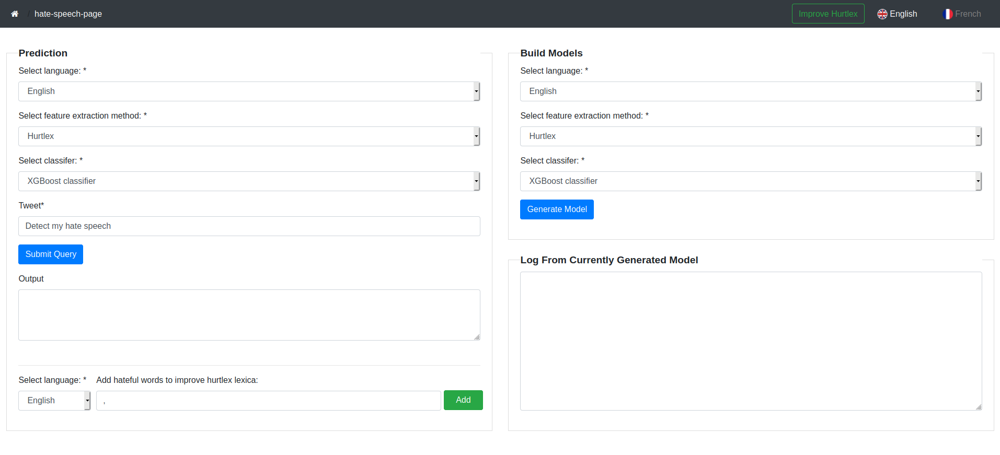
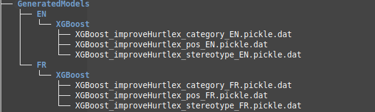
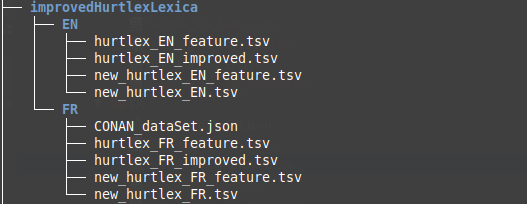
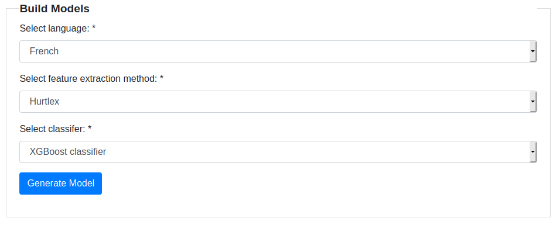
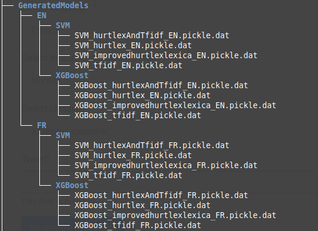
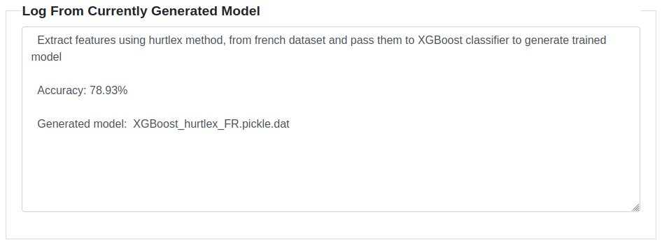

# Automated Hate Speech Detection Using Hurtlex, TFIDF, Hurtlex and TFIDF

### First step

**Important!** python3.6 is required

1. Change to code directory: `$ cd code`
2. Install virtuel env under: ***code/venv***
3. Install requirement from requirement.txt
4. Change to app directory: `$ cd app`
5. Start django application: `$ python manage.py runserver`

Note: Use **Pycharm** for better coding experiance

### How it looks like 😉



### Logic behind each block

**Button improve hurtlex in navbar**

* Generate features from the original hurtlex lexica using TfidfVectorizer and encode the label targets ( pos, category, stereotype, level ).
* Generate trained models using the extracted features from original hurtlex and use the encoded label to run the supervised learning.
* Extract features using TfidfVectorizer from the words to be used as hurtlex improver.
* Predict ( pos, category, stereotype ) labels by giving features from hurtlex improver to already generated trained models.

###### The label 'level' is hardcoded as: conservative, because the new hate words are conservative by the definition of hurtlex.

###### XGBoost is used as classifier by default since it gives good accuracy the SVM but it could be change manually in the code.

Genereted models tree: `$ cd app/GeneratedModels/ && tree`



Genereted files tree: `$ cd app/backend/improvedHurtlexLexica/ && tree`



`'hurtlex_EN_improved.tsv' and 'hurtlex_FR_improved.tsv': are the final output to be used to generate improved hurtlex model using Build model block.`

**Build Models Block**

Select between different input to generate trained models to be used in prediction.



Genereted models tree: `$ cd app/GeneratedModels/ && tree`



**Log From Currently Generated Model Block**



**Prediction Block**
- Predict:
  * Enter the target Tweet in tweet field and choose the target trained model by selecting from the given inputs, then click Submit Query.
  * The prediction decision is displayed in the output field: Hate Speech or Non Hate Speech.
  * If Hurtlex method is selected, the output field could display: doesn't exist in Hurtlex lexica, because the feature vector is all zeros so it doesn't make sence to predict the value.
- Add hateful words:
  * By selecting words from Tweet field, the words are added automatically to Add hateful words field.
  * this field is independent so it can be modified but make sure to Prefix every target word or words by `,` so it can be added in the desired way.
- Note: the added hateful words are just added to a pre-existing file, so in order to improve hurtlex, you should click the improve button and the regenerate the trained model.   

### Backend Functionality

The argument given to the MainClass in ***main.py*** file are:

-  ***language:*** ```FRENCH```, ```ENGLISH``` describe the language in use

-  ***methodName:*** ```HURTLEX```, ```TFTIDF```, ```HURTLEX_AND_TFTIDF```, ```IMPROVE_HURTLEX``` defines the method used to extract feature ( default: HURTLEX )

-  ***classifierName:*** ```XGBOOST```, ```SVM```, ```SVM_OPTIMIZER``` define the classifer in use to predict

   ###### Note: SVM_OPTIMIZER classifer use grid_svm to find the best parameters so it takes a long process for it to finish, that's why it's not included in frontend.

- ***labelName:*** ```POS```, ```CATEGORY```, ```STEREOTYPE```, ```LEVEL``` this param are only used for hurtlex improvement purpose

Copie and Paste code bellow and change the desired params to start, A log is printed in the console 
to better understand the process.

Predict:
```
process = MainObject(language, methodName, classifierName)
process.preProcessDataFunc()
process.featureExtractionFunc()
process.classifyFunc()
```

Improve Hurtlex:
```
# Pre-process conan dataset for french language only
if language == FRENCH:
    process = MainObject(language, IMPROVE_HURTLEX, XGBOOST)
    process.preProcessDataFunc()

# Feature extraction
improveHurtlex = improveHurtlexObject(language, XGBOOST)
improveHurtlex.extractFeatureFromOriginalHurtlexUsingTfidfVectorizer()
improveHurtlex.extractFeatureFromNewHate()

# Generate trained models
process = MainObject(language, IMPROVE_HURTLEX, XGBOOST, POS)
process.classifyFunc()
process = MainObject(language, IMPROVE_HURTLEX, XGBOOST, CATEGORY)
process.classifyFunc()
process = MainObject(language, IMPROVE_HURTLEX, XGBOOST, STEREOTYPE)
process.classifyFunc()

# Predict hurtlex labels and save them to file
improveHurtlex.improveHurtlex()
```
